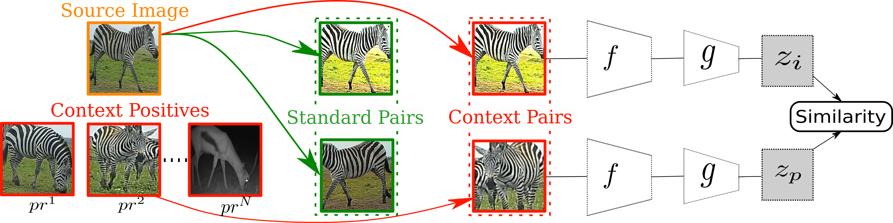
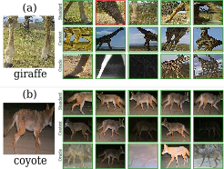

# Focus on the Positives: Self-Supervised Learning for Biodiversity Monitoring
This repository contains the code for reproducing the results of our ICCV 2021 [paper](https://arxiv.org/abs/2108.06435). The following figure illustrates our context positive approach within a SSL framework.

.


The organization of the repository is the following:

* `requirements.txt` Contains the libraries needed to run the code
* `demo.sh` is a sample script that launches parameterized training.
* `main.py` is the main process that orchestrates model training and evaluation.
* `models.py` Model utility functions.
* `datasets.py` Data utility functions i.e. Dataset classes
* `losses.py` has a set of supported loss functions.
* `evaluate.py` contains the code for evaluating model.
* `utils.py` contains useful utility functions, such as feature extraction, linear evaluation etc.
* `data_processing/preprocess_images.py` is used to filter images and extract the regions that contain objectx.
* `data_processing/preprocess_context.py` generates a file with meta-information for each image.


## Datasets
A large repository of camera trap datasets can be found at [lila.science](http://lila.science/), including Caltech Camera Traps (CCT20), Island Conservation Camera Traps (ICCT) and Snapshot Serengeti which were used for our main paper experiments.


## Getting started
*  Download images and the corresponding annotation file that includes the bounding boxes into a local path (/path/to/downloaded_data/). Note: If annotations are not available for a camera trap dataset, regions can be extracted by utilizing the [MegaDetector] (https://github.com/microsoft/CameraTraps/blob/master/megadetector.md) developed by Microsoft AI for Earth, something we tried on the supplemental material of the paper.
*  Install libraries and dependencies based on `requirements.txt`

## Data preprocessing
*  Filter and generate the training images by extracting the regions that correspond to the bounding box objects (i.e. animals) and store under cam_data/.
*  Generate dataframe including the metadata file of the above cropped images and save under cam_data/ i.e. cam_data/cct20_context_file.csv for the CCT20 dataset.
* The code for the above data processing steps lies under the `data_processing/` directory, in files `preprocess_images.py` and `preprocess_context.py` respectively.

## Running self-supervised pretraining and evaluating the performance on downstream task
*  The process is orchestrated by the `main.py` python file, where its parameters define the dataset, the self-supevised loss and positive mining technique will be chosen.  Other arguments cover various training or model parameters.
*  SSL can be replaced by fully supervised or transfer-learning to get a baseline.

<br>

## Tutorial

There follows an example of code executing the above steps. The example is for the CCT20 dataset and uses SimCLR as the base self-supervised learning approach.

### Step 1
Extract camera trap object regions from images (these can be either available from the given data or acquired from Megadetector)
```
python data_processing/preprocess_images.py --dataset cct20
```
### Step 2 
Save a metadata file for the contextual information of each image
```
python data_processing/preprocess_context.py --dataset cct20 --annotation_file CaltechCameraTrapsECCV18.json
```

### Step 3 
Learn representations with a variety of SSL training settings and evaluate their quality on a downstream task (i.e. species classification). 

The following scenarios cover standard SimCLR, SimCLR with sequence positives and SimCLR with context-informed positives:
```
python main.py --train_loss simclr --pos_type augment_self --backbone resnet18 --im_res 112 --dataset cct20 --exp_name "simclr standard"
```

```
python main.py --train_loss simclr --pos_type seq_positive --backbone resnet18 --im_res 112 --dataset cct20 --exp_name "simclr seq positive"  
```

```
python main.py --train_loss simclr --pos_type context_sample --backbone resnet18 --im_res 112 --dataset cct20 --exp_name "simclr context distance"   
```

In the above Python scripts important parameters include: `train_loss` which can be simclr, triplet, simsiam (for SSL pretraining) or rand_init,imagenet,supervised (for supervised or transfer-learning baselines). In addition `pos_type` parameter corresponds to the type of SSL approach and can be augment_self (standard augmentation), seq_positive (sequence positives), context_sample (context positives) and oracle (oracle positives).


The following graph compares the neighboring embeddings retrieved with our approach versus standard SSL and an Oracle best-case scenario:

<div style="text-align:center">
</div>

<br>

## Reference  
If you find our work useful in your research please consider citing our paper:  

```latex
@inproceedings{PantazisICCV2021,
  title={Focus on the Positives: Self-Supervised Learning for Biodiversity Monitoring},
  author={Pantazis, Omiros and 
          Brostow, Gabriel and 
          Jones, Kate and 
          Mac Aodha, Oisin},
  booktitle={Proceedings of the IEEE/CVF International Conference on Computer Vision},
  year={2021}
}
```
